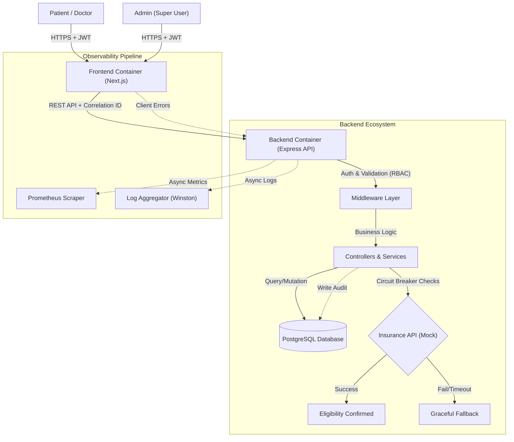

# 🏗️ MediConnect Enterprise Architecture

> **High-Level System Design & Engineering Standards**

## 1. System Overview
MediConnect is designed as a **Fault-Tolerant, Observable, and Secure** microservice-ready platform for healthcare scheduling. It adheres to strict enterprise standards including **HIPAA-compliant logging**, **Resilient API integrations**, and **Full-stack Observability**.

### Tech Stack
- **Frontend**: Next.js 16 (React 19), Tailwind CSS, TanStack Query.
- **Backend**: Node.js 22, Express, TypeScript, Prisma ORM.
- **Database**: PostgreSQL (Relational Data: Patients, Doctors, Appointments, Audit Logs).
- **Monitoring**: OpenTelemetry, Prometheus (Metrics), Winston (Logs).
- **Infrastructure**: Docker Compose (Containerized Production Environment).

---

## 2. High-Level Architecture Flow

The system uses a strict **Role-Based Access Control (RBAC)** model.

---

## 3. Administrative Logic (Super User)

MediConnect implements a "God Mode" mechanism for System Administrators:
-   **Seeding**: The first Admin is created via `prisma/seed.ts` using secure environment variables (`ADMIN_EMAIL`, `ADMIN_PASSWORD`).
-   **Visibility**: Admins bypass normal scoping rules and can query *all* entities (Doctors, Patients, Appointments, Logs).
-   **Creation**: New Admins can *only* be created by an existing authenticated Admin.

---

## 4. Key Enterprise Features

### 🛡️ Resiliency: Circuit Breaker
- **Problem**: Dependent services (like Insurance APIs) often fail or time out, causing cascading failures.
- **Solution**: We implemented an **Opossum Circuit Breaker**.
    - If the External API fails > 50% of the time, the circuit **OPENS**.
    - All subsequent requests fail *immediately* (Fast Fail) without waiting, saving resources.
    - After a cooldown (10s), it **HALF-OPENS** to test if the service is back.

### 🔍 Observability: Distributed Tracing
- **Problem**: In a microservice world, it's hard to track a single request across logs.
- **Solution**: **Correlation IDs**.
    - Every request gets a unique `UUID` (header: `x-correlation-id`).
    - This ID is passed to the Database logs, Application logs, and Error responses.
    - **Benefit**: You can "grep" one ID and see the entire lifecycle of a user's action.

### 🔄 CI/CD Automation
- **Pipeline**: GitHub Actions (`.github/workflows/ci.yml`).
-   **Linting**: Enforces code style.
-   **Testing**: Runs Unit tests to ensure logic soundness.
-   **Build**: Verifies the application compiles for Production (Node 22).

---

## 5. Security & Compliance
- **JWT Authentication**: Stateless, secure token-based access.
- **RBAC**: Strict separation (Patient vs Doctor vs Admin).
-   **Patient**: Can only see *own* data.
-   **Doctor**: Can see *assigned* patients.
-   **Admin**: Can see *all* data + Audit Logs.
-   **Sanitization**: All inputs validated via `Zod`.
-   **Audit Logs**: Tracks critical actions (Who accessed What and When).

---

> *This document serves as the high-level roadmap for Engineers, Architects, and Stakeholders.*

**Author**: Prashant Chaubey (<prashanttchaubey@gmail.com>)
