# 🧠 Backend Engineering: The Deep Dive

> **"Under the Hood" Documentation**
> *Use this guide to master the internal logic of the MediConnect Backend.*

---

## 🏗️ 1. Architecture Fundamentals

We use a **Layered Architecture** to separate concerns. This ensures that changing the database doesn't break the API reference, and changing the API doesn't break business logic.


### The Layers Explained
1.  **Entry Point (`server.ts`)**: Initializes the application, connects to DB, starts the HTTP listener.
2.  **Routes (`src/routes/`)**: Maps URLs (e.g., `/api/admin`) to Controllers.
3.  **Middleware (`src/middleware/`)**: The "Gatekeepers". They run *before* the controller.
    *   *Example*: `auth.middleware` checks if you are logged in.
    *   *Example*: `requestLogger` adds a Tracking ID (`correlationId`) to every request.
4.  **Controllers (`src/controllers/`)**: Handle HTTP (Request/Response). They parse input (`req.body`) and send output (`res.json`). **Logic-Light.**
5.  **Services (`src/services/`)**: The **Brain**. Contains all business rules (e.g., "Check if Doctor is free"). **Framework-Agnostic.**
6.  **Data Access**: Prisma Client.

---

## 🔐 2. Authentication & Security Logic

**Fundamental Question**: *How do we secure the API without storing sessions in a database?*

**Answer**: Stateless JWT (JSON Web Tokens).

### The Login Flow (Under the Hood)
When a user calls `POST /auth/login`:

1.  **Search**: We look for the user by email in PostgreSQL.
2.  **Compare**: We use `bcrypt.compare(inputPassword, storedHash)`.
    *   *Why?* We never store plain passwords. Use Salt + Hash.
3.  **Sign**: If valid, we create a JWT string containing:
    ```json
    { "userId": "123", "role": "ADMIN", "iat": 1700000000 }
    ```
    *   *Signature*: We sign this with `JWT_SECRET` from `.env`.
4.  **Return**: The Client gets the token.

### The Protection Middleware
Located in `src/middleware/auth.middleware.ts`.

```typescript
// Simplified Logic Snippet
const token = req.headers.authorization?.split(' ')[1]; // "Bearer <token>"
try {
  const decoded = jwt.verify(token, process.env.JWT_SECRET);
  req.user = decoded; // Attach user to request!
  next(); // Pass to Controller
} catch (err) {
  res.status(401).json({ message: "Invalid Token" }); // Halt!
}
```

---

## 👑 3. Admin System & Seeding Logic

**Fundamental Question**: *If I install this on a new server, the database is empty. Who creates the Admin?*

**Answer**: Automated Seeding (`prisma/seed.ts`).

### The "Seed" Script
This script is idempotent (safe to run multiple times).

1.  **Load Config**: Reads `ADMIN_EMAIL` and `ADMIN_PASSWORD` from Environment Variables.
2.  **Check Existence**: Queries DB for that email.
3.  **Create (Atomic)**:
    ```typescript
    // Logic Snippet
    if (!exists) {
       const hash = await bcrypt.hash(password, 10);
       await prisma.user.create({ data: { email, password: hash, role: 'ADMIN' } });
    }
    ```

### RBAC (Role-Based Access Control)
In `src/controllers/admin.controller.ts`:
We strictly enforce that `req.user.role === 'ADMIN'`. Even if a hacker has a valid Patient Token, they cannot access `/api/admin`.

---

## 🛡️ 4. Resiliency: The Circuit Breaker

**Fundamental Question**: *Why does one failing API (Insurance) not crash the whole server?*

**Answer**: The Circuit Breaker Pattern (`src/utils/circuitBreaker.ts`).

We wrap the dangerous call (External API) in a State Machine Container (`Opossum`).

### States
1.  **CLOSED (Normal)**: Requests go through. We count failures.
2.  **OPEN (Broken)**: We detect > 50% failure rate.
    *   *Action*: We **Block** all new requests immediately.
    *   *Error*: throwing "System Unavailable" instantly (0ms latency).
    *   *Benefit*: Prevents waiting 30s for timeouts. Saves CPU.
3.  **HALF-OPEN (Testing)**: After 10 seconds.
    *   *Action*: We let **1** request through.
    *   *Success*: Reset to CLOSED.
    *   *Fail*: Go back to OPEN.


---

## 📂 5. Git & GitHub Strategy

**Fundamental Question**: *What do I push to GitHub?*

**The Rule**: Code goes to GitHub. Configuration & Dependencies stay local.

### `.gitignore` Breakdown
This file ensures we don't leak secrets or upload garbage.

| Pattern | Explanation |
| :--- | :--- |
| **`node_modules/`** | **HUGE**. Contains thousands of library files. We run `npm install` to get these. Never commit. |
| **`.env`** | **SECRET**. Contains your Database Password and JWT Key. If you commit this, you are hacked. |
| **`dist/`** | **Artifact**. The compiled JS files. We build these from TS source. |
| **`coverage/`** | **Report**. Generated by tests. |

### Development Workflow
1.  **Clone** the repo.
2.  **Create `.env`** (Copy from `.env.example` if available).
3.  **Install**: `npm install` (Creates `node_modules`).
4.  **Run**: `npm run dev`.

---

---

## 6. 🤖 CI/CD: The Automated Gatekeeper

**Fundamental Question**: *How do you stop a junior dev from breaking the production server?*

**Answer**: GitHub Actions (Continuous Integration).

We defined a workflow in `.github/workflows/ci.yml`. Every time you `git push`, a robot in the cloud creates a fresh Ubuntu Server and runs this checklist:

1.  **Install**: `npm ci` (Clean Install). Ensuring dependencies work.
2.  **Lint**: `npm run lint`. Checks for sloppy code (unused variables, no types).
3.  **Test**: `npm test`. Runs `jest`. If the Calculator says 2+2=5, the deployment **FAILS**.
4.  **Build**: `npm run build`. converting TS to JS.

```mermaid
graph LR
    Dev[Developer] -->|Push Code| GitHub
    GitHub -->|Trigger| CI[CI Pipeline]
    
    subgraph "The Robot Checks"
        CI --> Lint[Linting 🧹]
        CI --> Test[Unit Tests 🧪]
        CI --> Build[Build Check 🏗️]
    end
    
    Lint -->|Pass| Test
    Test -->|Pass| Build
    Build -->|Pass| Merge[Ready to Merge ✅]
    
    Lint -->|Fail| Block[Block Merge ❌]
```



---

## 7. 🧪 Testing Strategy

**Fundamental Question**: *How do I know my changes didn't break existing features?*

**Answer**: Automated Testing with **Jest**.

### Unit vs Integration
-   **Unit Tests**: Test *one function* in isolation.
    *   *Tools*: `jest`.
    *   *Mocking*: We "fake" the database calls (`prisma.mock`).
-   **Integration Tests**: Test the *API Endpoint*.
    *   *Tools*: `supertest`.
    *   *Real World*: Spins up a test server and makes actual HTTP requests.

### How to Run Tests
```bash
# Run all tests
npm test

# Run and watch for changes (Dev Mode)
npm run test:watch

# Check how much code is covered
npm test -- --coverage
```

### Mocking Logic (Under the Hood)
When testing `AuthService`, we don't want to actually create users in the DB.
We use **Dependency Injection / Mocking**:
```typescript
jest.mock('../utils/db'); // Tell Jest to swap Real DB with Fake DB

test('should return token on login', async () => {
  prisma.user.findUnique.mockResolvedValue(mockUser); // Fake the DB response
  const result = await authService.login(...);
  expect(result).toHaveProperty('token');
});
```

---

**Author**: Prashant Chaubey (<prashanttchaubey@gmail.com>)
