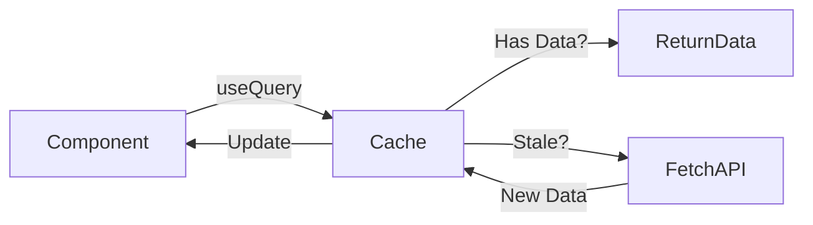

# 🧠 Frontend Engineering: The Deep Dive

> **"Under the Hood" Documentation**
> *Master the logic of the Next.js Client.*

---

## 🏗️ 1. Next.js Architecture: App Router

We use **Next.js 16**, which uses the **App Router** (`app/` folder). This changes how React works fundamentally.

### Logic: Server vs. Client Components

*   **Server Components (Default)**:
    *   Rendered on the **Server**.
    *   Output: Plain HTML sent to the browser.
    *   **Pros**: Fast, SEO-friendly, Secure (Direct DB access allowed).
    *   **Cons**: No user interaction (`onClick`, `useState` do not work).

*   **Client Components (`"use client"`)**:
    *   Rendered on the **Browser**.
    *   **Pros**: Interactive (Forms, Buttons, Modals).
    *   **Cons**: Larger bundle size.

**Our Pattern**: We keep pages (Server) simple and import interactive chunks (Client).
*   `app/login/page.tsx` (Server) imports `LoginForm.tsx` (Client).

---

## ⚡ 2. State Management: TanStack Query

**Fundamental Question**: *Why don't we just use `fetch()` in `useEffect()`?*

**Answer**: Caching, Deduping, and Status Management.

### The Algorithm (Stale-While-Revalidate)
When you load the Dashboard:
1.  **Check Cache**: Do we have data for `["appointments"]`?
2.  **Display**: If yes, show it immediately (Instant UI).
3.  **Fetch**: Secretly ask the API for new data in the background.
4.  **Update**: If API data is different, re-render the UI only then.



### Logic Snippet (`src/hooks/useAppointments.ts`)
```typescript
return useQuery({
  queryKey: ['appointments'], // The Cache ID
  queryFn: () => api.get('/appointments').then(res => res.data), // The Fetcher
  staleTime: 1000 * 60 * 5, // Data is "fresh" for 5 minutes
});
```

---

## 🔐 3. Authentication Context & Protection

**Fundamental Question**: *How do we make the whole app know who logged in?*

**Answer**: The Provider Pattern (`React.createContext`).

### The Flow
1.  **Provider (`AuthContext.tsx`)**: Wraps the entire app in `layout.tsx`.
2.  **State**: It holds `currUser` state.
3.  **Initialization**: On load, it checks `localStorage` or cookies for a token.
    *   If token exists -> Updates `currUser`.

### Middleware Protection (`middleware.ts`)
This runs **before** React even starts rendering.
*   **Location**: Root of project.
*   **Logic**:
    ```typescript
    if (request.nextUrl.pathname.startsWith('/dashboard')) {
      const token = request.cookies.get('token');
      if (!token) {
        return NextResponse.redirect(new URL('/login', request.url));
      }
    }
    ```
    *   **Benefit**: Instant redirect. No "flash of forbidden content".

---

## 📝 4. Git & GitHub Strategy

**Fundamental Question**: *What is safe to upload?*

### `.gitignore` Breakdown

| Pattern | Implementation Detail |
| :--- | :--- |
| **`.next/`** | The **Build Output**. Contains compiled Webpack chunks. We ignore this because GitHub Actions or Vercel will build it fresh. |
| **`node_modules/`** | Dependencies. |
| **`.env.local`** | **Strictly Secret**. Contains `NEXT_PUBLIC_API_URL` (usually fine) but may contain API Keys. We keep it standard to ignore all `.env` files. |
| **`.DS_Store`** | Mac system file (garbage). |

### Contributing Logic
1.  **Pull**: `git pull origin main`.
2.  **Branch**: `git checkout -b feature/new-login-ui`.
3.  **Code**: Make changes.
4.  **Push**: `git push origin feature/new-login-ui`.
5.  **PR**: Open Pull Request on GitHub.

---

---

## 5. 🤖 CI/CD: The Frontend Checks

**Fundamental Question**: *How do we ensure the UI doesn't crash?*

**Answer**: GitHub Actions.

In `.github/workflows/ci.yml`, for the frontend, we specifically check:
1.  **Lint**: Ensures React Rules (Rules of Hooks) are followed.
2.  **Build**: `npm run build`. This is the hardest step—it tries to "compile" all pages into static HTML/JS. If *any* page has a type error, this fails.

---

**Author**: Prashant Chaubey
